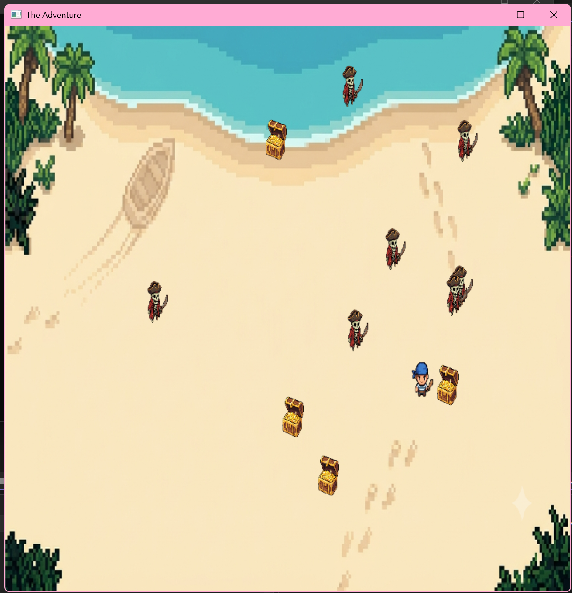

**Nuria Valero Bedia - Erasmus**

# Pirate Treasure Survivor

Pirate Treasure Survivor is a 2D top-down game developed in C# using .NET 10 and SDL.

The player controls a pirate looking for gold. The objective is to collect all treasure chests in each level while avoiding skeletons. Once all treasures are collected, the next level is loaded automatically and a new enemy appears to make it harder.

## Features

* Top-down movement
* Infinite levels
* Treasure collection system
* Automatic level progression
* Save and load support (High Score)

## Controls

* W, A, S, D / Arrow keys — Move
* Close window — Exit

## Build and Run

Requirements:
* .NET 10 SDK

Run the game:
`dotnet run`

## Gameplay

## AI Usage

See AI_USAGE.md for details about AI-assisted development.